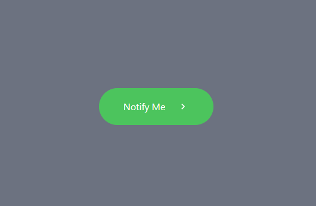

# Send LINE Notifications with React and Node.js



This project demonstrates how to send notifications through LINE Notify by integrating a React frontend with a Node.js backend. The Node.js server processes the API request when a button is clicked in the React app, delivering real-time notifications seamlessly.

## Author
Created by **Samiti**

## Prerequisites

Before you begin, make sure you have the following installed:

- [Node.js](https://nodejs.org/en/download/) (version 14 or higher)
- [npm](https://www.npmjs.com/get-npm) (comes with Node.js)

## Project Structure

```md
├── src/ 
│ 
├── components/ 
│ 
│ 
└── ClickNotify.tsx # React component to trigger the notification 
│ 
└── server.mjs # Node.js server (ES module) 
├── public/ 
│ 
└── index.html # Main HTML file 
├── package.json # Node.js dependencies and scripts 
├── README.md # Project documentation 
└── .gitignore # Files to ignore in Git
```

## Getting Started

### 1. Clone the Repository

```bash
git clone https://github.com/your-username/your-repo.git
cd your-repo
```
### 2. Install Dependencies
Run the following command to install the dependencies for both the React app and the Node.js backend:

```
npm install
```

### 3. Running the Application
To start both the React frontend and the Node.js backend, you can run the following command:

```
npm run dev
```

This will:

- Start the React application at `http://localhost:3000`
- Start the Node.js server at `http://localhost:5000`

### 4. Access the Application
Open your browser and go to http://localhost:3000. You will see a button that, when clicked, sends a request to the Node.js backend to trigger a notification

## Button Notification Feature

The React app includes a button that calls the `/notify` endpoint on the Node.js server when clicked. Here's how it works:

1. **Button Click**: The `ClickNotify` component sends a POST request to the backend at `http://localhost:5000/notify`.
2. **Backend Handling**: The Node.js server (`src/server.mjs`) receives the request and sends a notification to LINE Notify via their API.
3. **Server Response**: The server responds with the result of the notification request, which is logged to the console.

---

## Notify API

The backend uses the following API to send notifications:

- **Endpoint**: `https://notify-api.line.me/api/notify`
- **Method**: POST
- **Body**: URL-encoded data containing the notification message.

---

## Available Scripts

In the project directory, you can run the following scripts:

- `npm run dev`: Runs both the React app and Node.js server concurrently.
- `npm start`: Runs only the React app.
- `node src/server.mjs`: Runs only the Node.js backend.

## License

This project is licensed under the MIT License.

### Key Sections:
- **Prerequisites**: Lists the required tools.
- **Project Structure**: Gives a high-level overview of the files.
- **Getting Started**: Instructions on cloning, installing dependencies, and running the app.
- **Button Notification Feature**: Explains the functionality of the button triggering the `/notify` API on the server.
- **Notify API**: A brief description of the external notification API used in the backend.

You can modify this template according to your specific project needs! Let me know if you'd like to adjust anything.
